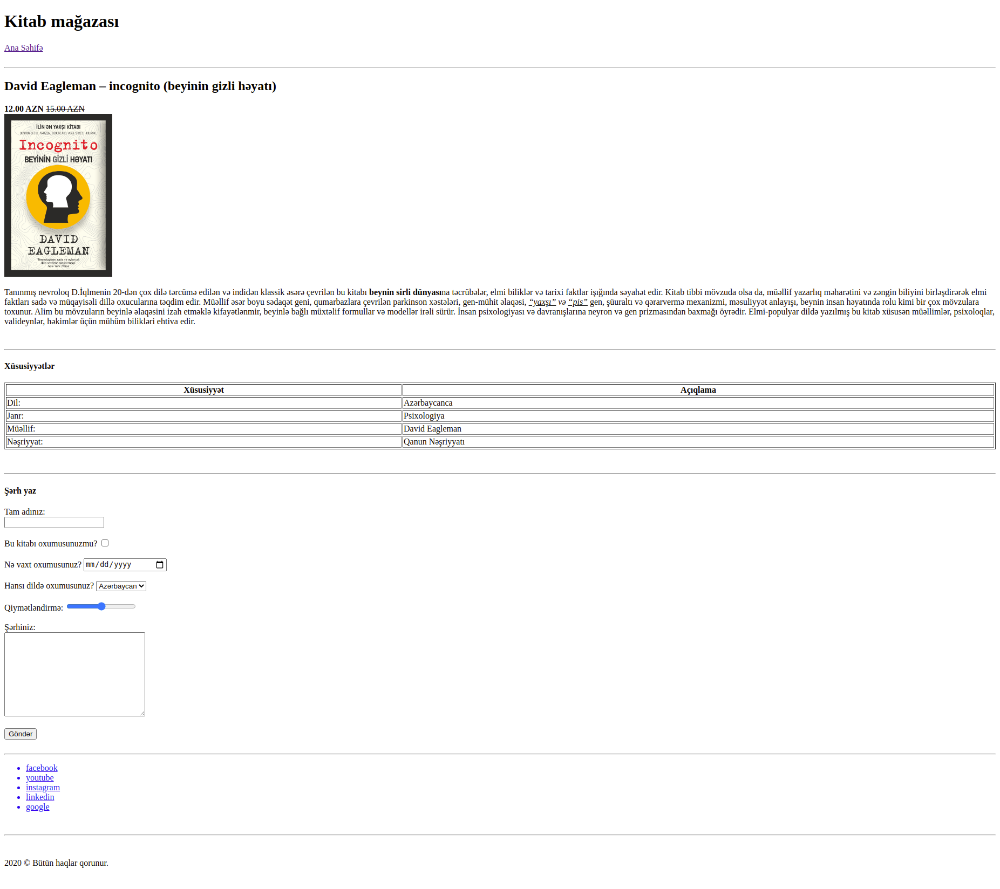

## BeginnerSE first sprint project: E-commerce website

### 1.day tasks

* The necessary files must be created for the project (index.html, product.html)
* A common html structure must be established in the index.html file (html, head, body, title, h1, p)
* A product page must be prepared (An image of the product page is provided below, and the page image is also available in this folder)
* The appearance of the product page should be obtained one by one as shown in the image
* The link to the home page should be working and should go to the home page when clicked
* There should also be a return link from the home page to the product page
* The image of the product must be in the images folder in the assets folder within the project
* The image should appear 200px wide when viewed on the site, and the title of the book should appear as alternative text if it is not uploaded
* The content of the book contains a bold section and underlined words
* The list of social networks should be a link and when you click on it, you should go to that site

### 1.day questions

* Write your answers to the answers.txt file in this folder.
* Explain in your own words, in your own language
* What is the GIT?
* Why we use it?
* What is the GITHub?
* How the web browser works.
* What are HTML tags for?
* What are Attributes for?

